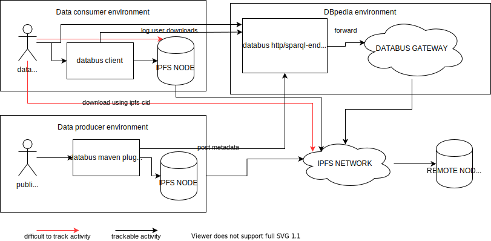

# Initiation, community bonding period
We had two meetings with Sebastian and Aman. I've got better understanding of how databus works, and what should be done. 
We have also discussed organisational issues. I've been granted rights to the databus-maven-plugin repo, 
and given access to development server. Plan for this week is also to publish sample graph with the plugin.
# Week 1 (June 1 - June 7)
This week is not very productive as expected. I have finished work in Japan and had a flight on 2nd of June back to Germany. On 3rd I was setting everything up, this is going to continue for a few days more, but I will also work on the project (just not fulltime). Started reading the code of the databus-maven-plugin. Successfully built it. Read docs on how to develop maven plugins. Got better understanding of how it works. In general, looks very simple. Trying to publish my first dataset with the plugin. 
# Week 2 (June 8 - June 14)
- got better acquainted with the code of databus maven plugin and its configuration
- created a sample test project (https://github.com/manonthegithub/publishdata) to try uploading in the databus (using databus maven plugin), and uploaded test dataset
- read ipfs documentation
- investigated ipfs api and ways of integration
- installed ipfs node on my local pc, and on test server
- tested ipfs (saving small files works well, global CIDs work)
- tried http-api
- looked at the existing scala-client, looks like its not supported any more
- wrote sample implementation of uploading of small files

# Week 3 (June 15 - June 21)
- got better understanding of how ipfs works (watched a few tutorials, asked questions on their forum and in github, read more docs)
- 
- started implementation of directories uploading
- developed a few ideas of how to track user downloads (make dbpeadia's ipfs gateway, possibly encrypt the data on the user upload)
- got better understanding on how to deal with versioning (use ipld, smart chunkers)
- made an architecture draft

# Week 4 (June 22 - June 28)
todo
